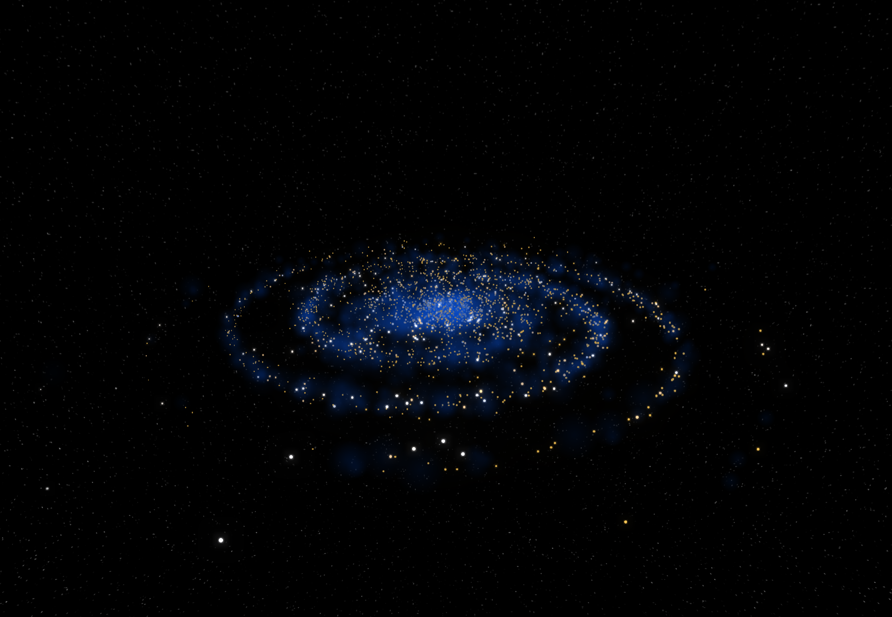

# Customizable 3D Spiral Galaxy

Made with **Svelte** and **Three.js (Threlte)**

### How to install/preview

<ul>
  <li>
    <code>git clone https://github.com/Ventriix/sveltekit-threlte-3d-galaxy</code>
  </li>
  <li>
    <code>pnpm install</code>
  </li>
  <li>
    <code>pnpm dev</code>  
  </li>
</ul>

This project is basically **[this](https://github.com/pickles976/GalaxyThreeJS)** project with a few changes and converted to Svelte and Threlte.
